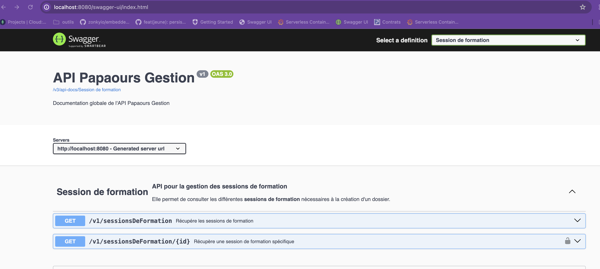

# Interview RTS Solutions

##  Introduction
Bienvenue au test RTS Solutions !

Tu as été invité(e) à effectuer un test dans le cadre de notre processus d'évaluation.

Tu trouveras ci-dessous toutes les informations nécessaires pour réussir ce test.

N'hésite pas à poser des questions en nous contactant à l'adresse e-mail suivante : welcome@rtssolutions.fr. Objet : I need help!

Pour réaliser le test dans les meilleures conditions, suis les étapes suivantes :

1. Crées ton dépôt sur github privé.
2. Clone le dépôt git du projet.

```(bash)
git clone https://github.com/rtssolutions/papaours-interview.git
```

3. Supprime l'ancien lien du dépôt et ajoute le tien.

```(bash)
git remote remove origin && git remote add origin https://github.com/{TonCompte}/{TonDepot.git}
```
4. Publie les changements sur ton dépôt
```bash
git branch -M main
git push -u origin main
```
5. Effectue des commits au fur et à mesure de ton avancement.
```bash
git add [chemin/du/dossier/ou/fichier|.]
git commit -m "mon commit"
git push
```
6. Donne-nous l'accès à ton dépôt git pour que nous puissions examiner tes développements.

   Tu pourras faire cela sous https://github.com/{TonCompte}/{TonDepot}/settings/access

   Voici la liste des utilisateurs à ajouter :
    - remi-hamy
    - TheoCanonne
    - hamyfrancois


L'objectif de ce test n'est pas seulement d'évaluer le résultat final, mais aussi de comprendre ta méthodologie, ton processus de réflexion et ta manière de résoudre des problèmes non familiers.
Si tu rencontres des problèmes, n'hésite pas à nous contacter. Nous sommes là pour t'aider !

## Exercice

### Préambule

RTS solution souhaite apporter aux acteurs de l’apprentissage **LA** plateforme de référence en permettant de mettre en relation "un jeune", un employeur et sa formation

Ici, nous te proposons donc de développer une fonctionnalité nous permettant de créer un "jeune".

Tu dois certainement te demander ce que l'on entend par "jeune".

C'est un terme métier que nous utilisons, cher RTS solutions, pour désigner une personne ayant les caractéristiques suivantes :

### Besoin métier

En tant qu'utilisateur de la plateforme

Je veux saisir un jeune

Afin de le référencer dans un contrat d’apprentissage

#### Description et règles de gestion

Un jeune est caractérisé par les informations suivantes:


- un nom (obligatoire)
- un prénom (obligatoire)
- une adresse mail (obligatoire)
- une date de naissance (obligatoire)
- un numéro de sécurité sociale (obligatoire)

La qualité et la cohérence de la donnée étant primordiale chez RTS Solutions, le numéro de sécurité sociale devra être valide selon les règles suivantes:


* Sexe → doit être égal à 1 ou 2
* Année de naissance → Correspond à l’année de naissance saisie( 2 derniers chiffres de l’année de naissance)
* Mois de naissance → doit être entre 01 et 12 et doit correspondre au Mois de naissance saisi (les deux chiffres du mois de naissance)
* Département → pas de vérification à effectuer
* Numéro Insee → doit être entre 001 et 999
* L'ordre d'enregistrement: pas de vérification à effectuer
* Clé de sécurité → Calculé via cette formule : 97 - ((l'ensemble des chiffres précédent) modulo 97).

Enfin, un jeune ne peut pas avoir **moins de 15 ans** et ne peut pas avoir **plus de 30 ans**.

### Réalisation technique et conseils

Mettre à disposition une route d'API permettant de créer un Jeune.

L'application sur laquelle tu interviendras est une API, développée en Kotlin et Spring (Java 21).

Nous te conseillons vivement d'utiliser Intellij en tant qu'IDE (cet IDE te propose directement de télécharger tout ce qui est nécessaire pour démarrer le serveur).

L'API contient déjà un module sessionformation, permettant de récupérer des sessions de formations.

Analyse ce module pour **créer et architecturer un module jeune** .

L'application ne s'appuie sur aucune base de données (les informations retournées par le module sessionformation sont des informations statiques (voir SessionDeFormationInMemoryRepository)).

Pour cet exercice, **nous ne te demandons pas de mettre en place de base de données** :

Lorsque tu créeras la route permettant de créer un jeune, nous te demandons de t'assurer que les informations saisies décrivant le jeune soient correctes, ce jeune n'a pas besoin d'être persisté **pour le moment** (on prévoit cependant bientôt de le persister, ton code devra donc permettre au prochain développeur de le faire).

Enfin, tu remarqueras que le module sessionformation dispose de classes testées.

Nous souhaitons donc que tu mettes en place des tests applicatifs (on te laisse le soin de juger de la pertinence de tester chaque classe ou non).

### Démarrer l'API

Une fois le projet cloné et importé dans ton IDE, effectue la commande `gradle clean bootJar`

Tu peux ensuites démarrer l'API depuis ton IDE.

Pour t'assurer que ton API soit correctement démarrée, consulte la route suivante: `http://localhost:8080/swagger-ui/index.html`

Tu devrais alors voir ceci:




Nous te souhaitons bonne chance pour ce test ! Nous sommes impatients de découvrir ta démarche et ta créativité pour résoudre les défis présentés.


